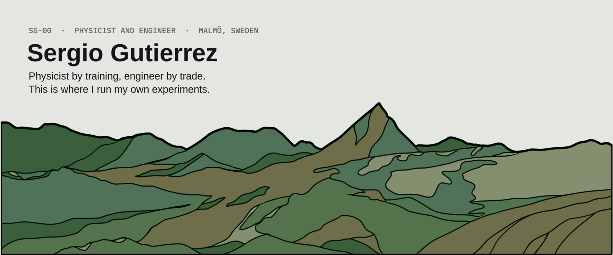
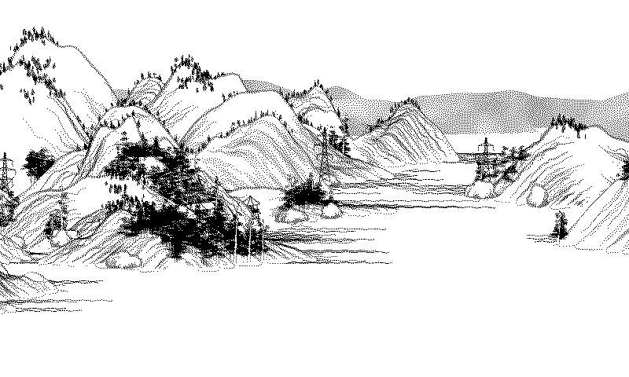
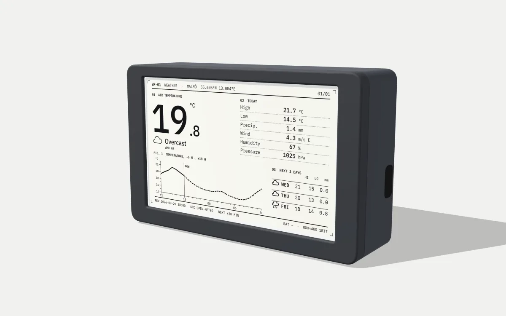
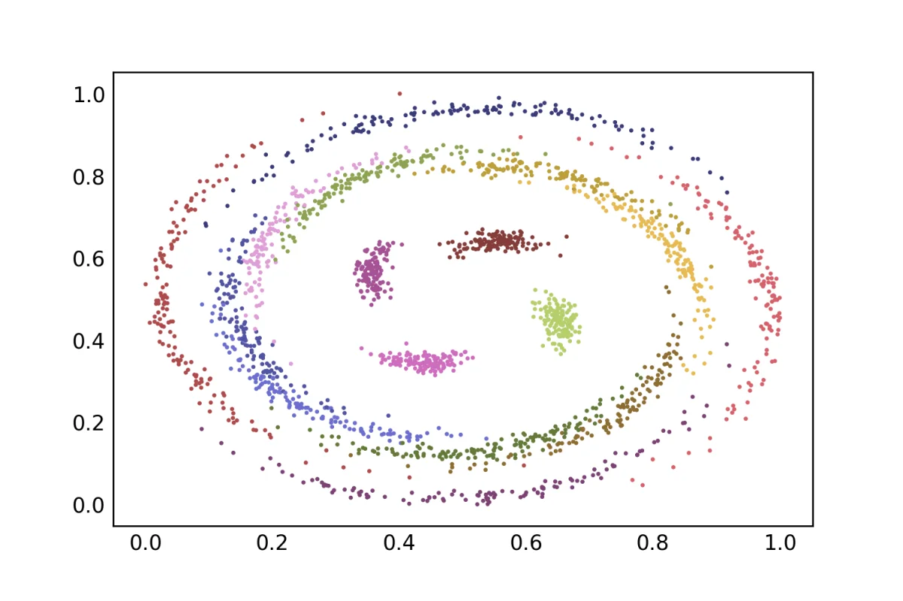
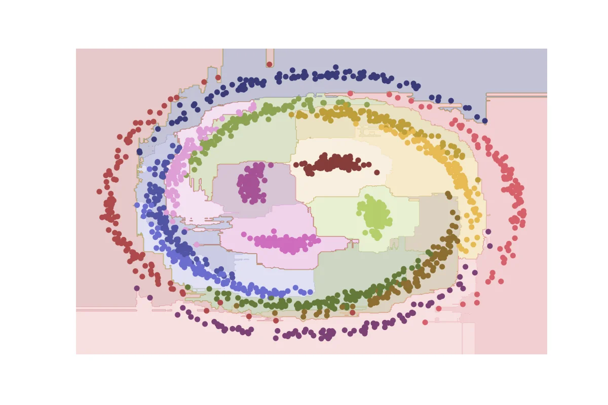
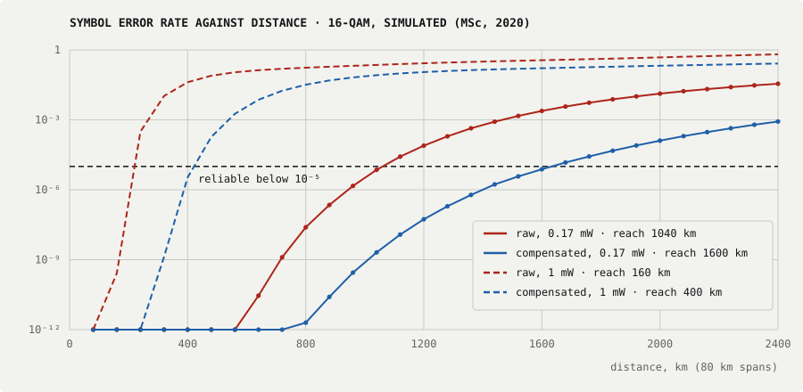
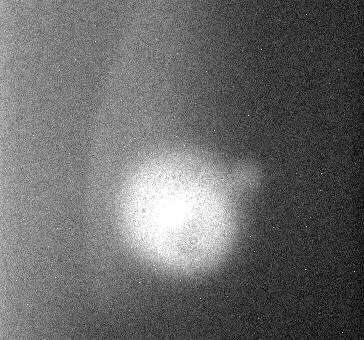
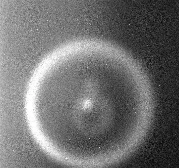

<picture>
  <source media="(prefers-color-scheme: dark)" srcset="assets/banner-dark.png">
  
</picture>

I studied light: entangled photons in Colombia, then fibre optics and machine learning in Lund. Since 2020 I have worked at Ericsson, from digital pre-distortion and ASICs to 6G prototypes. In my own time I build machine-learning projects and small devices, and write them up.

**[Website](https://website-nine-olive-89.vercel.app)** · **[LinkedIn](https://www.linkedin.com/in/sergio-gutierrez-a43875183/)** · **[Email](mailto:sergio.s.gutierrez@outlook.com)**

> *"Nothing is too wonderful to be true, if it be consistent with the laws of nature; and in such things as these, experiment is the best test of such consistency."*
> — Michael Faraday, laboratory diary, 1849

---

## Building

<table>
<tr>
<td width="50%" valign="top">
 
<b>E-Display</b> · a 4.26″ e-paper frame that draws generative art, fresh every time it wakes. Board, screen and battery run together; the case is designed, not yet printed. 
Art: <a href="https://github.com/LingDong-/shan-shui-inf">shan-shui-inf</a> by Lingdong Huang (MIT), as the panel shows it.
</td>
<td width="50%" valign="top">
 
<b>WF-01 Weather Frame</b> · the first device written up as a datasheet: a 3D model you can take apart, the wiring and a power budget. 
Render of the 3D model. <a href="https://website-nine-olive-89.vercel.app/lab/prototypes/wf-01">Datasheet →</a>
</td>
</tr>
</table>

| Project | What it is | Stack |
|---|---|---|
| [random-plan](https://github.com/ChiefGuti/random-plan) | One button, one random hidden-gem plan in Malmö. A daily scraper keeps the list fresh. | FastAPI · Turso · GitHub Actions · Vercel |
| [claude-load](https://github.com/ChiefGuti/claude-load) | My Claude Code set-up, portable: 18 agents, 8 safety hooks, 21 commands. Clone it and Claude walks you through the install. | Claude Code · shell |
| [Personal site](https://website-nine-olive-89.vercel.app) | Theses, lab datasheets and notes in a datasheet style, with interactive figures drawn from the thesis data. | Next.js · MDX · three.js |

---

## Research

### MSc · Lund University, KTH and RISE · 2020 · learning the noise of an optical fibre

A fibre's Kerr effect turns bright symbols further than dim ones, and a square constellation winds into a spiral that straight decision lines cannot separate. Instead of modelling the fibre, I let a classifier learn the decision regions from the received symbols.

<table>
<tr>
<td width="50%"></td>
<td width="50%"></td>
</tr>
<tr>
<td>16-QAM after 63 × 80 km at 1 mW: what the receiver sees.</td>
<td>The decision regions a random forest learns from it.</td>
</tr>
</table>

Drawn from the thesis simulation files. On the long single-channel link the learned receiver matched the compensation scheme that knows the link, and stretched reach 2.5 times.

[Thesis (PDF and LaTeX)](https://github.com/ChiefGuti/msc-photonics-thesis) · [Simulation and classifier code](https://github.com/ChiefGuti/optical-fiber-ml-classifier) · [Interactive version](https://website-nine-olive-89.vercel.app/research/nonlinear-phase-noise)

### BSc · Universidad de los Andes · 2017 · entangled photons

<table>
<tr>
<td width="50%"></td>
<td width="50%"></td>
</tr>
<tr>
<td colspan="2">Turning the crystal: a laser through a BBO crystal makes photon pairs, and their light opens from one spot into a full ring. My CCD photos from the lab, thesis Fig. 2.4 (CC BY-NC-SA 4.0).</td>
</tr>
</table>

The lab taught me order: a clear concept, a careful attempt, an honest assessment, then another try. [Read the story →](https://website-nine-olive-89.vercel.app/research/entangled-photons)

---

## Background

**Ericsson, Malmö, since 2020.** Algorithm and ASIC design, then digital pre-distortion across five ASIC generations, now technical lead for 6G prototypes. Industrial supervisor for MSc theses at Lund University and Universidad Politécnica de Madrid. Views here are my own.

**Tools:** Python · C · MATLAB · TypeScript · SQL · LaTeX · scikit-learn · FastAPI · Next.js · FPGA and ASIC flows

Coursework from 2017 lives here too: a [Lasso regression notebook](https://github.com/ChiefGuti/lasso-regression-notebook) and a [2D heat-equation solver in C](https://github.com/ChiefGuti/2d-heat-equation-solver).
